# TakeTopDSHTeam

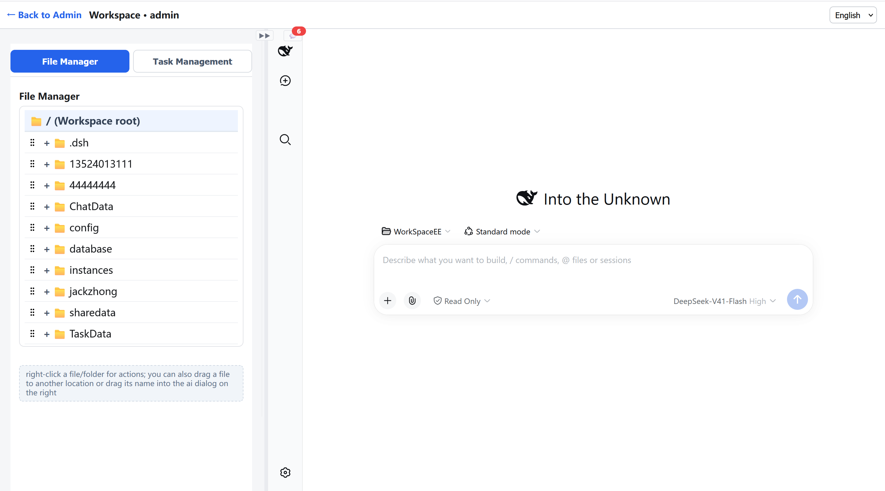

TakeTopDSHTeam turns DeepSeek Harness (DSH) into a team-oriented, multi-user AI collaborative work platform — a self-hosted web workspace suitable for any industry (software development, engineering design, document editing, media processing, and more). Each member has an independent split-screen workbench with a built-in isolated DSH, file management, and task management features; conversations, files, and tasks are shared across the team, allowing knowledge to continuously accumulate and efficiency to keep improving. It supports multiple large models (DeepSeek, OpenAI, Claude, Kimi, Local Model, etc.), all user can share a single AI LLM API Key — easier to manage and more cost-effective!

> 👥 **Who it's for:** Teams already using (or wanting to use) AI agents but needing **multi-user collaboration and full data control** — they don't want to install a separate AI agent for each person, nor hand their data over to a cloud service.

## Highlights

🧠 Team experience sharing — Every member's work experience becomes reusable knowledge for the whole team. The more it's used, the better it gets!

👤 Per-user isolation — Each user runs independently in a dedicated sandbox workspace. Users cannot access each other's workspace directories.

🖥️ Split-screen workbench — Left side = File manager / My tasks; Right side = DSH conversation.

🔌 Single entry point, single port — All members share one login URL, with one launcher reverse-proxying to each member's DSH.

✅ Task assignment & dispatch — Admins assign tasks to members (rich text + images + attachments); supports "continue dispatching" for multi-level delegation, with inline expandable parent / subtask trees. All stored in a shared database.

📁 Built-in file manager — Upload, folders, tree browsing, compress/decompress, rename, move, delete, online preview, download — right-click menu for everything.

🌐 Bilingual interface — Full English / Chinese support across all pages, switch anytime!

🚀 One-click, offline installation — Copy the folder and run; no compilation, no extra downloads.

> **MIT License (open source).** Licensed under the **MIT License** (see [LICENSE](LICENSE) / [COPYING](COPYING)) — you are free to use, modify and distribute it, including for commercial purposes, provided the copyright notice is retained. For larger teams that need **per-member token control** and **hierarchical member management**, we also offer a paid **Enterprise edition** (see below).

---

## Quick Start

```
Windows : double-click start.bat   (UAC administrator prompt — required for per-user OS isolation)
macOS   : bash start.sh
Linux   : bash start.sh
```

> **On startup,** on Windows the elapsed time is shown live in the window title bar, and the browser opens automatically once it is ready — no need to refresh.

Open `http://127.0.0.1:46001` → log in (Account: admin  Password: 12345678)→ click **Open DSH**.

Setup and usage: [USER_GUIDE_English.pdf](USER_GUIDE_English.pdf).

> 📦 **Why is the download package so large (500+ MB)?** On purpose — for your convenience. The release package **bundles every file needed to install on all three operating systems — Windows, macOS and Linux** (the self-contained launcher for each platform, the Node.js runtime, and the offline `@deepseek-ai/dsh` packages). So one download gives you a **fully offline, one-click install** on any of them — no further downloads and no compilation on the target machine.

---

## Feature Tour

### 1. Launcher Console (admin)
Start/stop the default DSH, edit config (appsettings URL / workspace / default language), and manage every member:

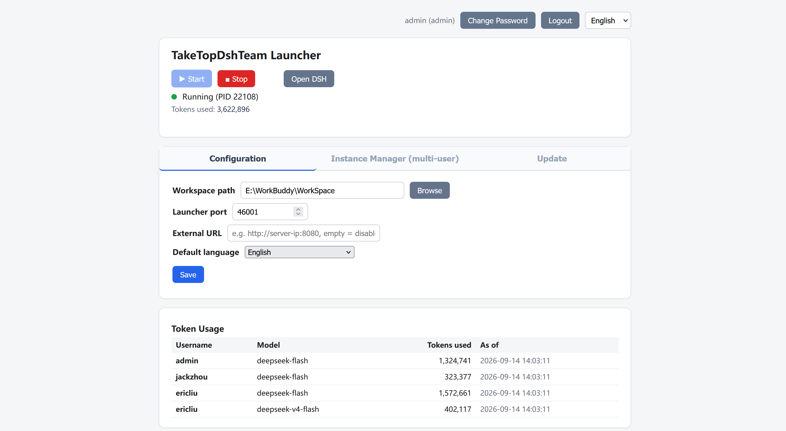

Each member also gets a simple **Management** page — start/stop their own DSH, open it, and see that user's logs:

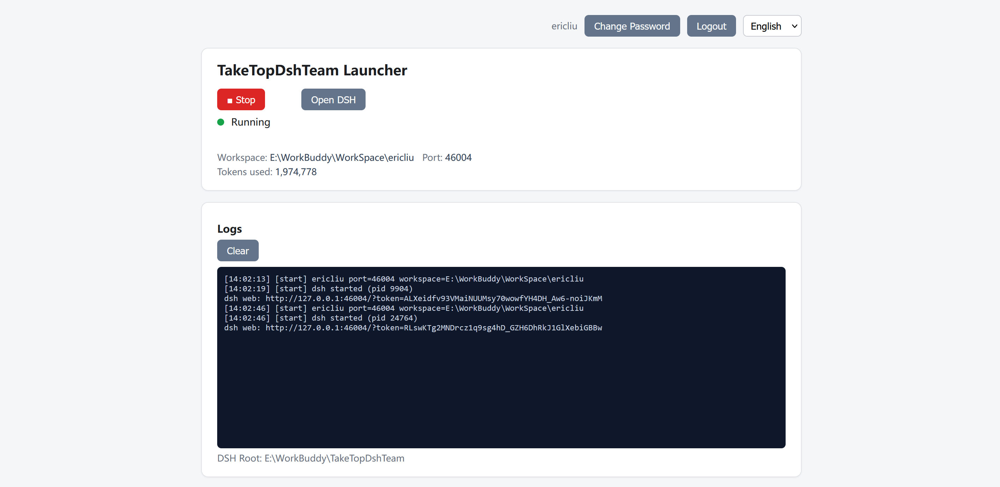

- **Create User** — auto workspace (`<global-workspace>/<username>`), dedicated OS user + sandbox.
- **Start / Stop / Open / Delete / Reset Password** per member.

### 2. Workbench (split screen)
- Click **Open DSH** on a member row (or the launcher's "Open DSH") → split workbench.
- **Left pane** tabs: **File Manager** and **My Tasks**.
- Resize: drag the divider, or the ⤢ button toggles 30% ↔ 70%.


### 3. File Manager
- Upload, new folder, refresh; tree view with `+`/`-` expand.
- Per-file actions (right-click): zip / unzip / rename / move / delete.
- Preview inline (images, text, video); non-previewable files prompt to download.
- **Drag a file into the AI dialog** to hand it straight to the agent.
- Leaders can also upload and distribute project files to each member's workspace directory.

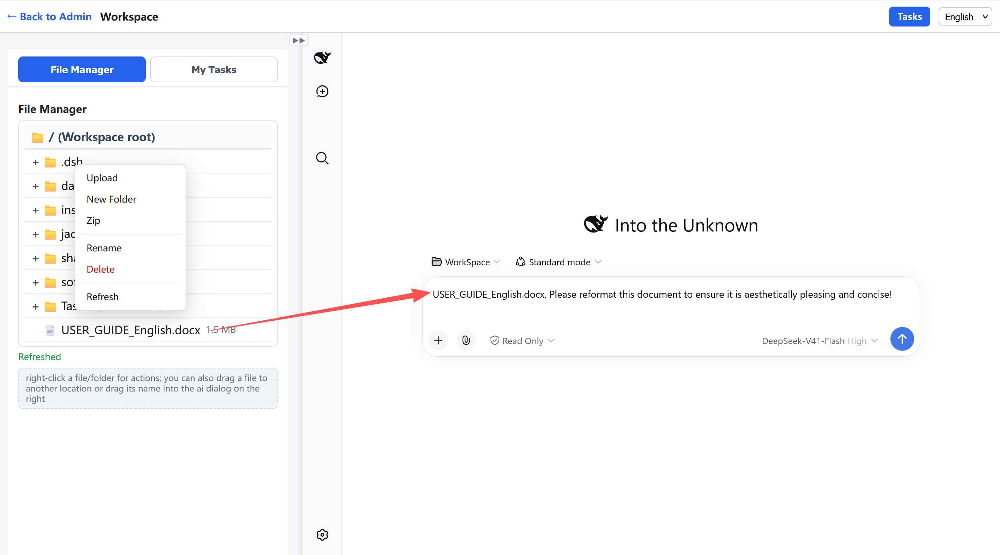

### 4. My Tasks
Each user sees tasks assigned to them:

- Task-name link opens a detail popup (rich content; double-click an image for full-screen preview).
- Related files open/download; images preview directly.
- **Drag a task name into the AI dialog** to start working on it.
- **Continue Assign** — create a follow-up (child) task and choose its **assignee**; the sub-task lands in that member's My Tasks, and the parent row auto-expands to show it.
- **Edit / Delete** — rows you created get Edit and Delete buttons (your own tasks only).
- **Subtask tree** — a `+` in the subtask column expands a task's children inline (indented, multi-level); tasks without children show no `+`.
- Leaders can assign tasks to each member, and members can also assign tasks to one another. Task documents follow the task as it flows, and work results can be fed back in real time!

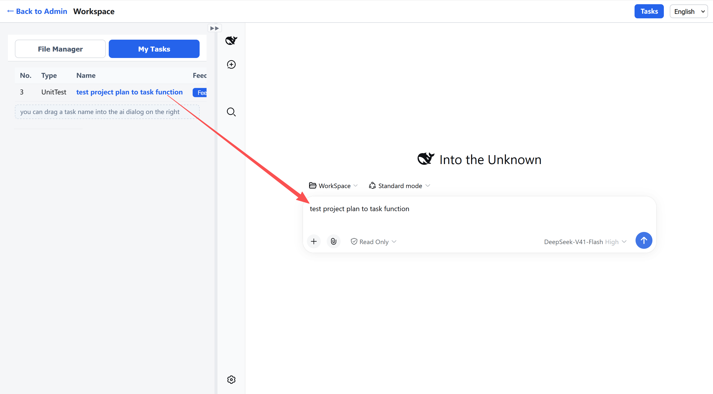
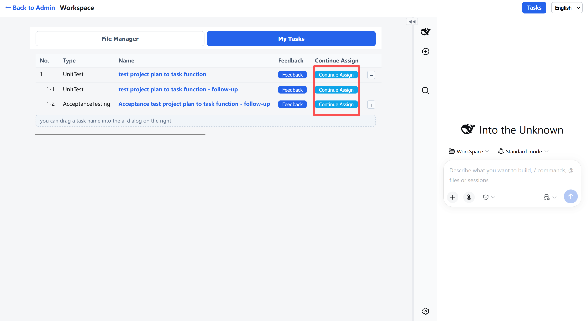
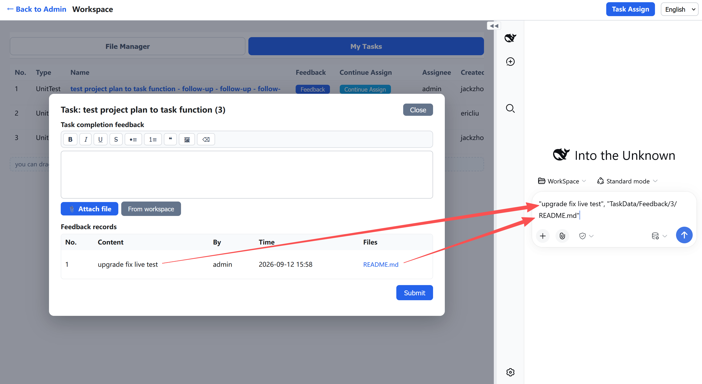
-You can also drag the feedback description and related documents into the DSH chat box on the right for AI to process.！ 


### 5. Task Assignment — `/tasks`
- Member list on the left; pick a member to see their tasks on the right.
- **Add / Edit** a task: **Assignee**, **Type** (type dropdown + `+` to add a new type), **Name**, **Content** (rich text — bold/lists/quote, paste or insert images), **Assigned At**, **Status** (Processing / Done / Cancelled), **Related files** (multi-select upload).
- **Subtask hierarchy** — every task row has a `+` column; click it to expand that task's subtasks inline (indented, multi-level). Each child stores its parent's **No. (seq)** as its parent task (default `0` = top level); tasks without children show no `+`.
- Tasks are stored in the launcher's shared **database** (`<workspace>/database/taketopDSHTeam.db`); attachments go to `<workspace>/TaskData/Doc`.

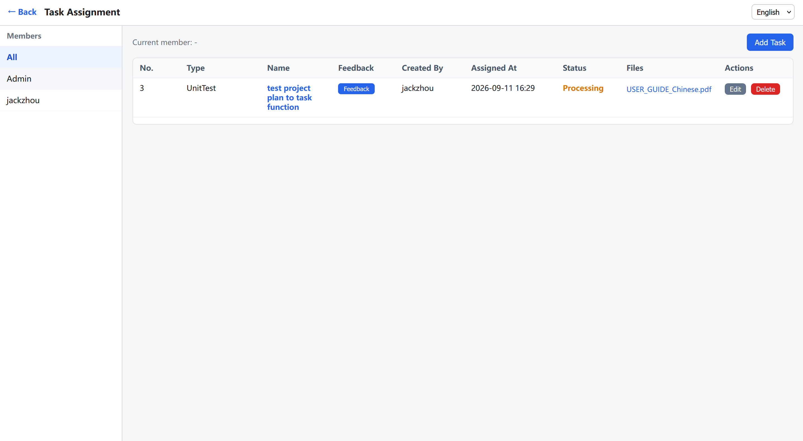
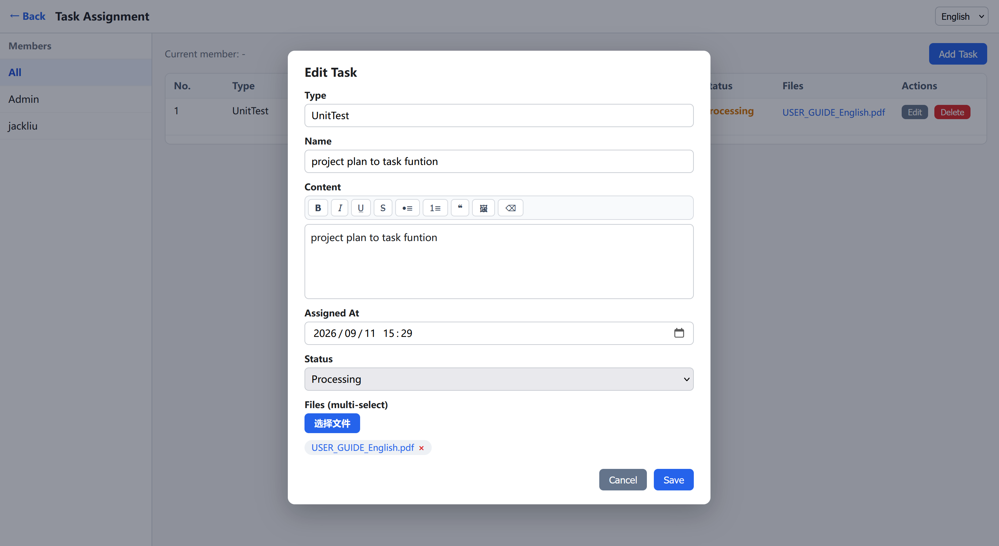
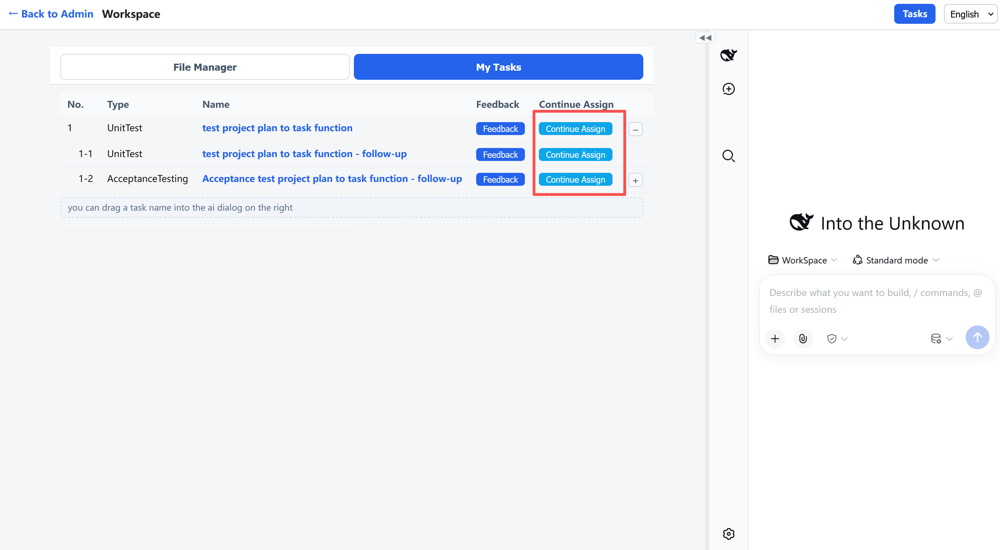

### 6. Language
Full **English / Chinese** toggle across the console, workbench, file manager, task assignment, and task form. The login page prefers the configured default language.

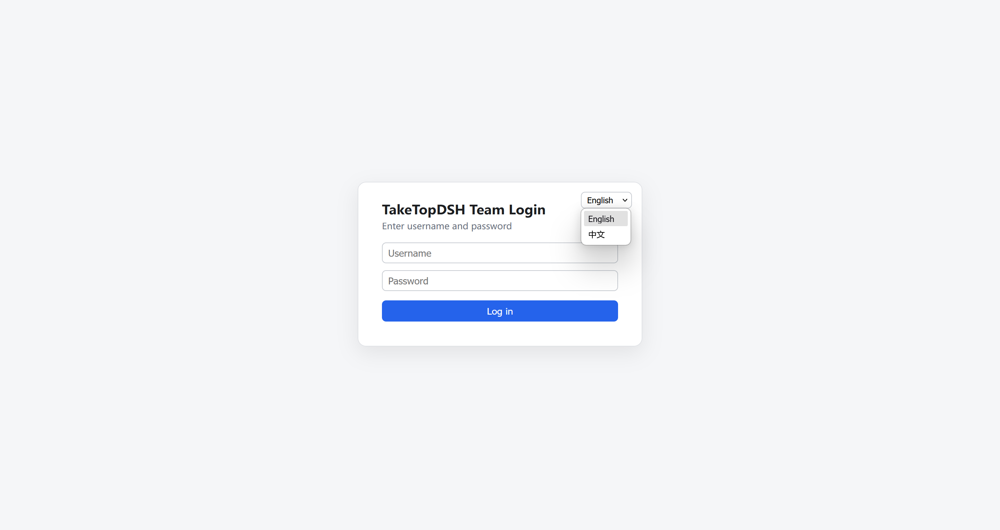

---

## Architecture

```
┌────────────┐  :46001   ┌─────────────┐   WebSocket / HTTP proxy
│  Browser    │─────────▶│  Launcher    │──────────▶ DSH :46000 (admin default)
└────────────┘           │──────────▶ DSH :46002 (jackzhong)
                         │  multi-user  │──────────▶ DSH :46003 (ericliu)
                         └─────────────┘──────────▶ ...
```

- Launcher (self-contained, no .NET needed on target) serves the admin/workspace/tasks UI and proxies DSH requests, injecting the auth token so users never see "authentication required".
- Each DSH runs under a **restricted OS user** with sandboxed workspace and contained read access.
- A **patch layer** (idempotent) re-applies launcher customizations after DSH upgrades.

---

## Platform support

| Platform | Node | @deepseek-ai/dsh deps |
|----------|------|------------------------|
| Windows x64 | bundled, offline | bundled, offline |
| macOS / Linux (x64 & arm64) | bundled (tar, offline) | bundled (offline tarball); falls back to `npm install` only if the bundle is missing |

---

## Get started

- **Download** — grab the latest release from the **Releases** page (or clone this repository). One package covers Windows / macOS / Linux and installs offline.
- **Questions, feedback, bugs** — open an **Issue** on GitHub.

Topics: `deepseek-harness` · `multi-user` · `self-hosted` · `ai-agent` · `llm` · `team-collaboration` · `sqlite`

---

## Enterprise edition (paid)

This repository is the **Standard** edition, and it is **MIT-licensed and free**. For teams that need more governance, we offer a paid **Enterprise edition** that adds:

- **🧮 Per-member token control** — see and control each member's token usage.
- **🏛️ Hierarchical (pyramid) member management** — a normal member can create and manage sub-members work, and each sub-member can, in turn, create further sub-members and manage their work, forming a pyramid-style management structure.
- **📱 Mobile APP pages** — built-in touch-optimized mobile interface; access the workbench, file manager, and AI chat anytime, anywhere through your mobile phone.
- **🛠️ Support** — during the paid period we provide uninterrupted service and quickly help resolve any usage issues.

**Pricing:** **USD 10 per user per month** (e.g. 10 users = USD 100/month; 15 users = USD 150/month; 20 users = USD 200/month). Contact **service@taketopits.com** — see [LICENSE-COMMERCIAL.md](LICENSE-COMMERCIAL.md).

---

## License

This project (the **Standard** edition) is licensed under the **MIT License** — see [LICENSE](LICENSE) / [COPYING](COPYING).

- You may use, copy, modify, merge, publish, distribute, sublicense, and/or sell copies of the software, including for commercial purposes, provided the copyright notice and this permission notice are retained.
- A paid **Enterprise edition** is also available (see [Enterprise edition](#enterprise-edition-paid) above); its commercial terms are described in [LICENSE-COMMERCIAL.md](LICENSE-COMMERCIAL.md).

The intellectual property of this software — including its source code, design, documentation and related materials — is vested in **TaiDingTuoDing Information Technology (Shanghai) Co., Ltd.** (Email: service@taketopits.com). The license grants usage rights but does not transfer ownership of the intellectual property, which remains with the copyright holder.

Third-party components bundled with this product remain under their own licenses (see `gui-cs/src/wwwroot/vendor/licenses/` and [NOTICE](NOTICE)).

Copyright (c) 2026-2036 TaiDingTuoDing Information Technology (Shanghai) Co., Ltd. All rights reserved.
